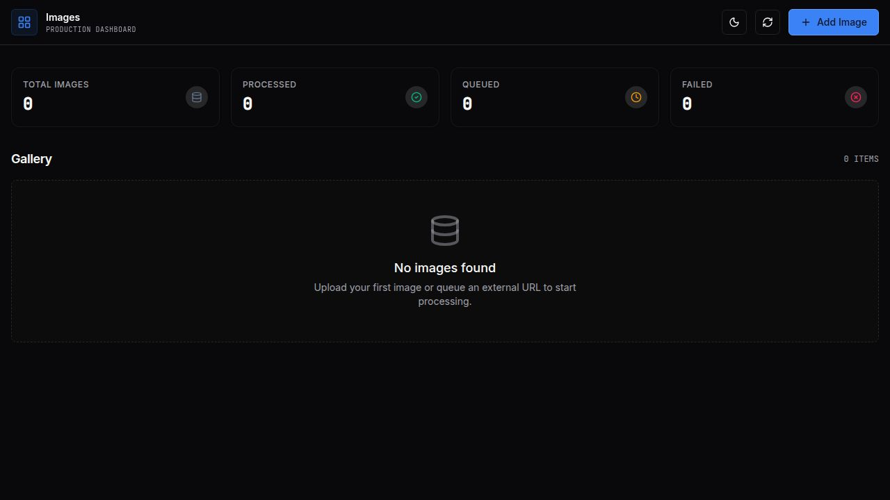

# Images Dashboard

A modern, reactive management dashboard for the [WildDev/images](https://github.com/WildDev/images) image-processing service.

### Screenshot



### Get started

Requirements:
* Node.js ≥ 20
* pnpm ≥ 9

Clone the repository and install dependencies:

```bash
git clone https://github.com/WildDev/images-dashboard.git
cd images-dashboard
pnpm install
```

Configure environment variables:

```dotenv
# URL of a running WildDev/images service instance
IMAGES_SERVICE_URL=http://images:8080

# Required — secret used for Express session signing
SESSION_SECRET=change_me_to_something_random
```

Start the API server:

```bash
pnpm --filter @workspace/api-server run dev
```

Start the dashboard in a separate terminal:

```bash
pnpm --filter @workspace/images-dashboard run dev
```

Open the printed local URL in your browser.

Alternatively, build and run with Docker:

```bash
docker build -t images-dashboard .
docker run -p 8080:8080 \
  -e SESSION_SECRET=change_me_to_something_random \
  -e IMAGES_SERVICE_URL=http://images:8080 \
  images-dashboard
```

> [!NOTE]
> When `IMAGES_SERVICE_URL` is not set the dashboard runs in local-only mode: images are tracked in memory and processed thumbnails are not available.

### Credits

Built with [Replit](https://replit.com).

### License

*This project is licensed under the Apache License 2.0.*

Dependencies:

- React (MIT)
- Vite (MIT)
- Express (MIT)
- Tailwind CSS (MIT)
- shadcn/ui (MIT)
- Zod (MIT)

See [LICENSE](LICENSE) file for details.
